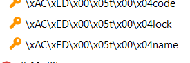
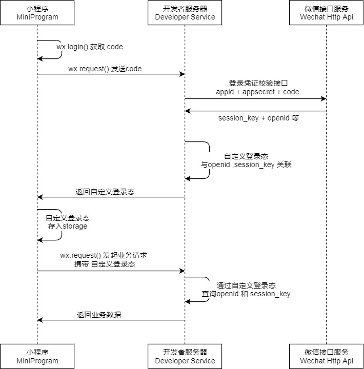

7.2

#### 自定义注解，和动态代理的联系

#### 切面

#### Result

#### 所有出现的注解解释

#### 配置属性类 怎么读取yaml，porperity 源码 横线转驼峰命名


bean注解是在启动的时候初始化

file.getBytes()

Swagger对上传图片不支持

所有常量使用类静态变量统一管理

实体类为啥都要定义序列版本号

获取sql语句返回的主键id

同时对两个或者多个数据库操作，需要考虑事务一致性

```java
在入口开启事务，@EnableTransactionManagement
在方法上，使用注解@Transactional
  
```

请求参数是Query还是Body（json）

所有出现的sql语句

Spring-data-redis使用

```txt
1、导入maven
2、配置redis数据源
3、编写配置类，创建RedisTemplate对象
4、通过RedisTemplate对象操作redis
```

* redis配置类不是必须的，因为 Spring Boot 框架会自动装配 RedisTemplate 对象，但是默认的key序列化器为JdkSerializationRedisSerializer(存储二进制字节码)，导致我们存到Redis中后的数据和原始数据有差别，故设置为StringRedisSerializer序列化器。
* 使用注解@Bean，创建Bean对象；如果不用，也会自动装配对象，但是序列化器不一样，存储key数据会乱码
* 
* 

@RestController("adminShopController")

@RestController("userShopController")

对于admin和user包下面的同名ShopController，在启动的时候报错，可以在RestController("备注")


#### 微信登陆后端逻辑



##### 微信登陆

1、接受前端请求DTO对象，根据DTO对象里面的Code(授权码)，获取OpenId

```java
// 调用微信接口服务，获取微信用户的openid
// WX_LOGIN== "https://api.weixin.qq.com/sns/jscode2session"
private String getOpenid(String code){
//调用微信接口服务，获得当前微信用户的openid
	Map<String, String> map = new HashMap<>();
	map.put("appid",weChatProperties.getAppid());
	map.put("secret",weChatProperties.getSecret());
	map.put("js_code",code);
	map.put("grant_type","authorization_code");
	String json = HttpClientUtil.doGet(WX_LOGIN, map);
	JSONObject jsonObject = JSON.parseObject(json);
	String openid = jsonObject.getString("openid");
	return openid;
}
    
```


2、判断openid是否为空，如果为空表示登录失败，抛出业务异常，不为空，继续

```java
if(openid == null){
throw new 		 LoginFailedException(MessageConstant.LOGIN_FAILED);
}
```

3、判断该openId是否为新用户

```java
User user = userMapper.getByOpenid(openid);
```

4、如果为新用户，自动完成注册

```java
if(user == null){
	user = User.builder()
	.openid(openid)
	.createTime(LocalDateTime.now())
	.build();
	userMapper.insert(user);//后绪步骤实现
}

```

5、返回用户对象

##### 为微信用户生成jwt令牌，用户id信息保存在token令牌里面

```java
Map<String, Object> claims = new HashMap<>();
claims.put(JwtClaimsConstant.USER_ID,user.getId());
String token = JwtUtil.createJWT(jwtProperties.getUserSecretKey(),
jwtProperties.getUserTtl(), claims);

UserLoginVO userLoginVO = UserLoginVO.builder()
    .id(user.getId())
    .openid(user.getOpenid())
    .token(token)
    .build();

return Result.success(userLoginVO);

```

##### 拦截器检验用户端小程序token

