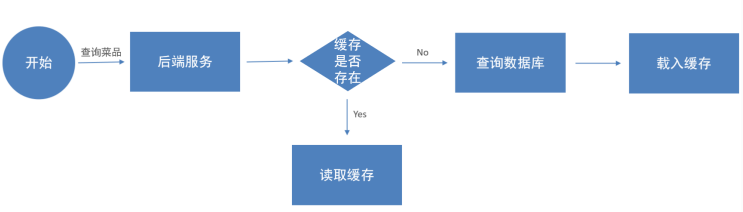
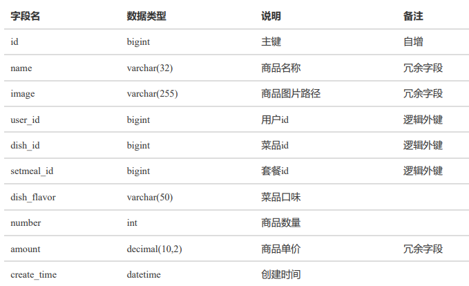

#### day07

##### Redis缓存 缓存菜品

缓存菜品

缓存套餐 

添加购物车 

查看购物车 

清空购物车


通过Redis来缓存菜品数据，减少数据库查询操作



缓存逻辑分析： 

* 每个分类下的菜品保存一份缓存数据 

* 数据库中菜品数据有变更时清理缓存数据
* String类型，key设置为用户id + 菜品分类id

为了保证数据库和Redis中的数据保持一致，修改管理端接口 DishController 的相关方法，加入清理缓存逻辑

* 新增菜品 
* 修改菜品 
* 批量删除菜品 
* 起售、停售菜品

* 完成上述步骤之后，删除缓存；下次查询的时候，如果没有缓存，就从数据库中查询，同时将查询的数据放入redis

##### Spring Cache 缓存套餐

提供了一系列缓存注解，用于操作缓存数据

@EnableCaching：开启缓存注解功能，通常加在SpringBoot启动类上

@Cacheable： 在方法执行前先查询缓存中是否有数据，如果有数据，则直接返回缓存数据；如果没有缓存数据，通过反射调用方法并将方法返回值放到缓存中

@CachePut ： 将方法的返回值放到缓存中

@CacheEvict： 将一条或多条数据从缓存中删除

* CachePut 

```java

/**
* CachePut：将方法返回值放入缓存
* value：缓存的名称，每个缓存名称下面可以有多个key
* key：缓存的key
*/
@PostMapping
// 使用spring EL表达式，#user代表形参，id代表user的属性
// result.id : #result代表方法返回值，代表以返回对象的id属性作为key
// #p0.id, #a0.id, #root.args[0].id 都一样
@CachePut(value = "userCache", key = "#user.id") //key的生成：userCache::1
public User save(@RequestBody User user){
    //传参里面的user的id为null，经过sql属性id自增返回值后，user的id得到修改
    // 操作完成后，加入缓存，因为user都是同一引用，所以可以返回id
    userMapper.insert(user);
    return user;
}
```

* Cacheable，用于查询，可以返回缓存

```java
/**
* Cacheable：在方法执行前spring先查看缓存中是否有数据，如果有数据，则直接返回缓存数据（不走下面的controller，走代理对象controller）；若没有数据，调用方法,查数据库，并将方法返回值放到缓存中
* value：缓存的名称，每个缓存名称下面可以有多个key
* key：缓存的key
*/
@GetMapping
@Cacheable(cacheNames = "userCache",key="#id")
public User getById(Long id){
    User user = userMapper.getById(id);
    return user;
}
```

* @CacheEvict 说明： 作用: 清理指定缓存 

  * value: 缓存的名称，每个缓存名称下面可以有多个key 
  * key: 缓存的key 

  ```java
  @DeleteMapping
  @CacheEvict(cacheNames = "userCache",key = "#id")
  //删除某个key对应的缓存数据
  public void deleteById(Long id){
  	userMapper.deleteById(id);
  }
  @DeleteMapping("/delAll")
  @CacheEvict(cacheNames = "userCache",allEntries = true)
  //删除userCache下所有的缓存数据
  public void deleteAll(){
  	userMapper.deleteAll();
  }
  ```

  #### 购物车——添加购物车 

  

  * 判断当前商品是否在购物车中
  * 如果已经存在，就更新数量，数量加1
  * 如果不存在，插入数据，数量就是1
    * 判断当前添加到购物车的是菜品还是套餐
    * 添加到购物车的是菜品
    * 添加到购物车的是套餐

  

  #### 查看购物车

  #### 清空购物车

  

  